# sc-microservices-platform

> spring-cloud 微服务架构

## Project structure

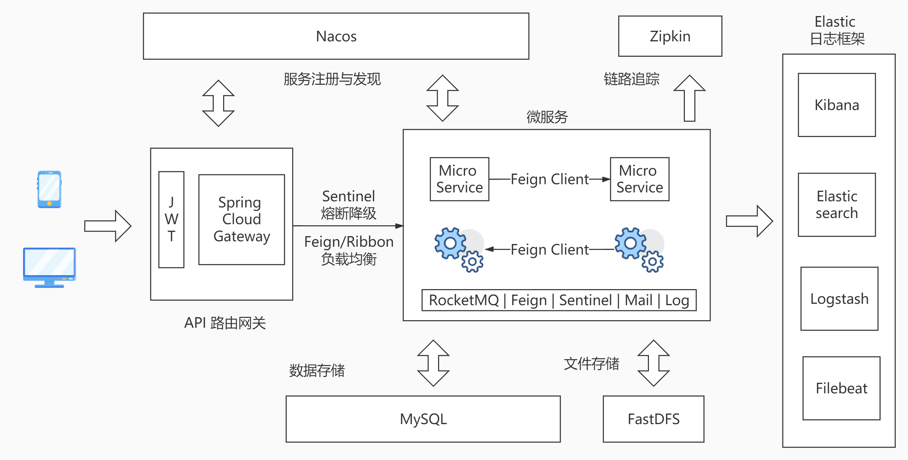

```lua
sc-microservices-platform -- 父项目，公共依赖
│  ├─sc-business -- 业务模块一级工程
│  │  ├─commons-domin -- 公共domain模块
│  │  ├─document-center -- 公文中心[8081]
│  │  ├─file-center -- 文件中心[8082]
│  │  ├─message-center -- 消息中心[8083]
│  │  ├─user-center -- 用户中心[8084]
│  ├─sc-config -- 配置中心，其余模块可以引入此模块，以统一配置
│  ├─sc-gateway -- api网关一级工程[8080] -- jwt验证
│  ├─db-sql -- 数据库SQL文件
```

## 开发环境

> 运行环境

| 工具     | 版本                                 |
| -------- | ------------------------------------ |
| Java     | 8                                    |
| Maven    | 3.6.3                                |
| MySQL    | 5.7+，8+                             |
| IDE      | IntelliJ IDEA 2020.1.4               |
| Docker   | 19.03.12                             |
| Linux    | CentOS Linux release 7.4.1708 (Core) |
| Elastic  | 7.8.0                                |
| 代码仓库 | Github                               |

> Linux 配置 （虚拟机）

| IP/Port          | Description        |
| ---------------- | ------------------ |
| 192.168.168.3    | 虚拟机 IP 地址     |
| 8848             | nacos-server       |
| 8910             | sentinel-dashboard |
| 7777             | rocketmq-console   |
| 9411             | zipkin（docker）   |
| 22122,23000,8888 | Fastdfs（docker）  |

| IP/Port       | Description            |
| ------------- | ---------------------- |
| 192.168.168.4 | 虚拟机 IP 地址         |
| 9200,9300     | Elasticsearch（docker) |
| 5601          | Kibana（docker)        |
| 5044          | Logstash（docker)      |
| ###           | Filebeat（docker)      |

> 组件选择

- 分布式系统套件版本：Spring Boot 2.x + Spring Cloud + Spring Cloud Alibaba
- 服务治理注册与发现：Spring Cloud Alibaba Nacos
- 服务降级、熔断和限流：alibaba/Sentinel
- 网关路由代理调用：Spring Cloud Gateway
- 声明式服务调用：Spring Cloud OpenFeign
- 数据访问层：Mybatis-plus/Mybatis
- 数据库：MySQL 5.7/MySQL 8
- 统一日志收集存储：ELK + Filebeat
- 消息队列：RocketMQ
- 微服务链式追踪：Zipkin
- 权限验证：JWT （Java Web Token）

## 功能简介

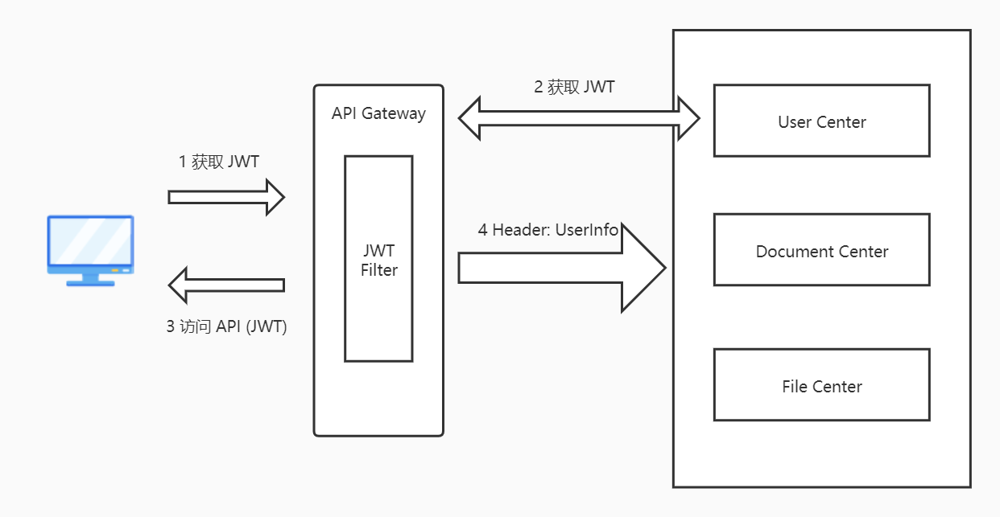

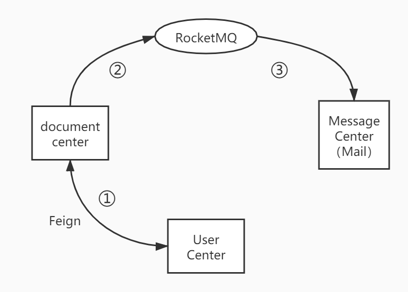

### document-center

```shell
# 发送公文
│  ├─openfeign -- 集成 sentinel 实现了 fallback
│  │  ├─调用 user-center -- 判断时间条件,获取用户信息
│  ├─rocketmq
│  │  ├─向 message-center -- 发送 DMessage(包含用户邮件信息)
```

### message-center

```shell
# 监听 document-center rocketmq 消息，向用户发送邮件
│  ├─rocketmq
│  │  ├─监听 document-center rocketmq 消息
│  ├─mail
│  │  ├─向用户发送邮件
```

### user-center

```shell
│  ├─JWT
│  │  ├─生成并验证 JWT
│  ├─api
│  │  ├─ CRUD (user & department) api
```

### file-center

```shell
# 上传下载文件
│  ├─fastdfs
│  │  ├─upload
│  │  ├─download
```

### ELKF 日志框架

```shell
│  ├─elasticsearch
│  ├─logstash
│  ├─kibana
│  ├─filebeat
```


## Project screenshots I

### Nacos

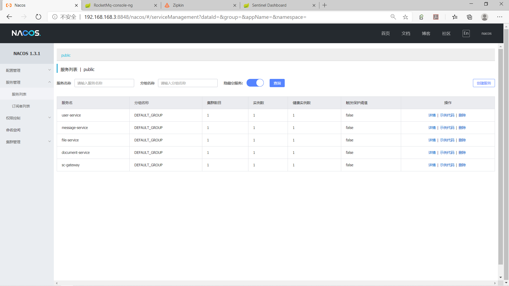

### RocketMQ

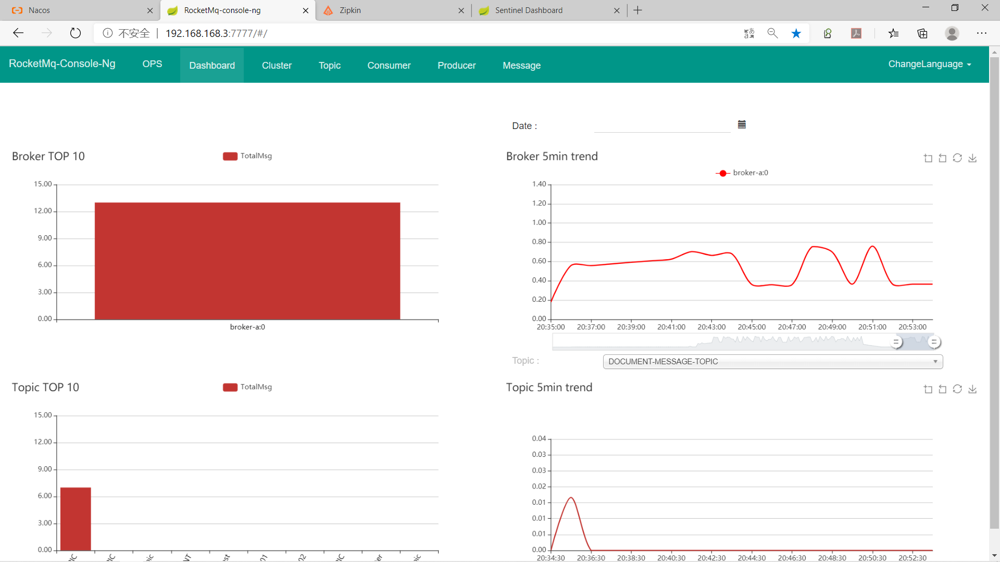

### Sentinel

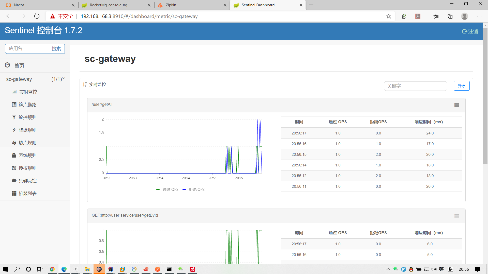

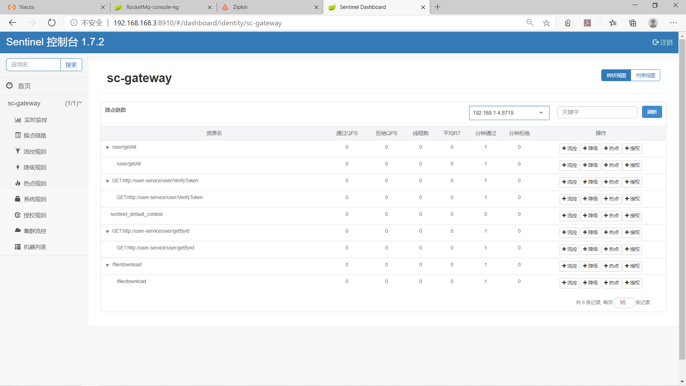

### Zipkin

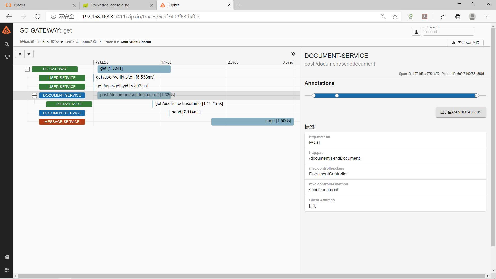

### Elasticsearch

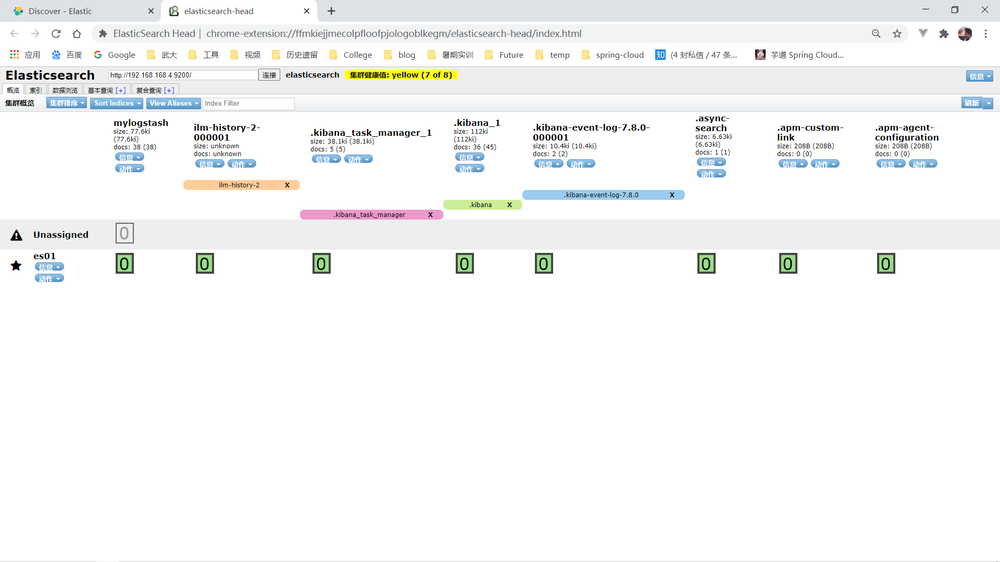

### Kibana

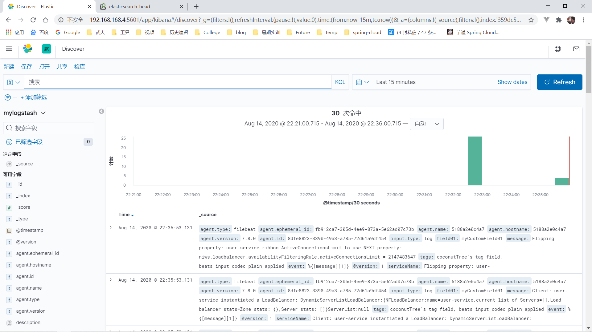


## Project screenshots II

> All Request sent to the **Api-Gateway**

### user-center || register -> login (JWT)

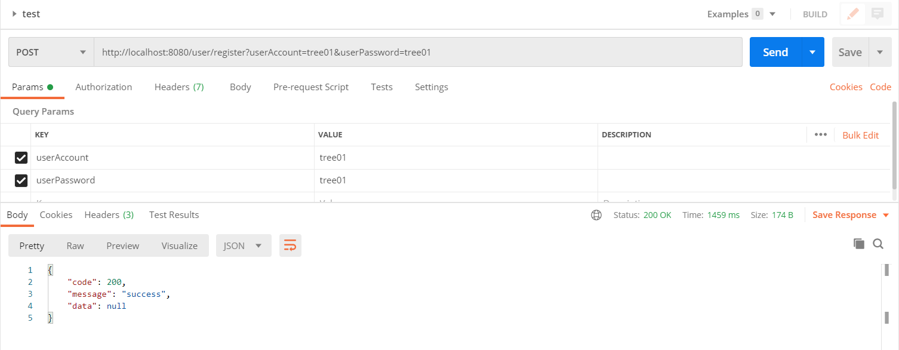

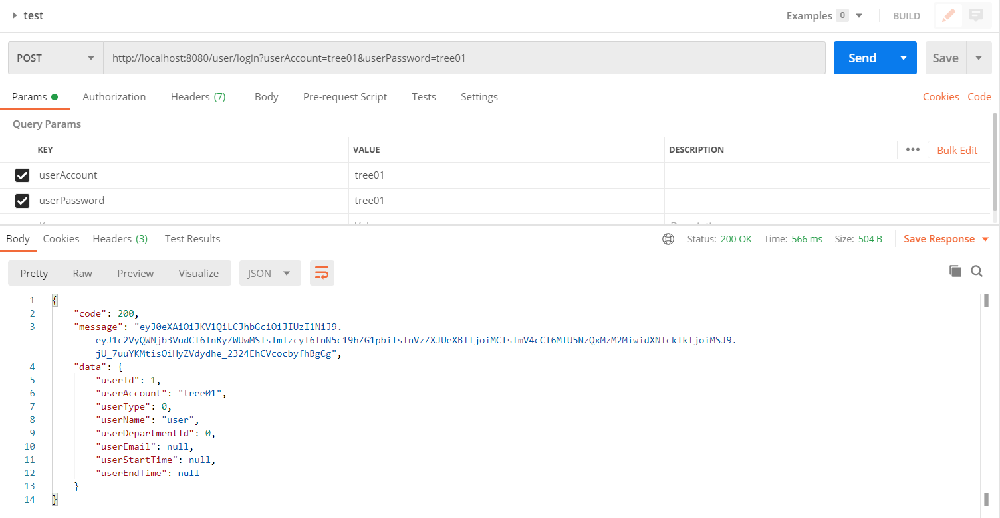

### file-center || upload -> download

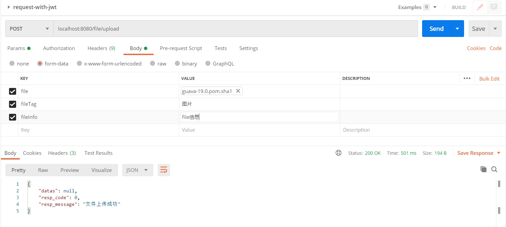

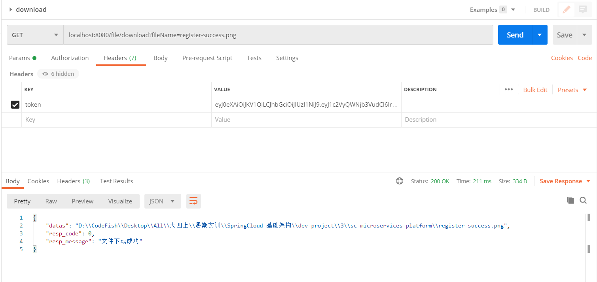

### document-center -> rocketmq -> message-center -> mail


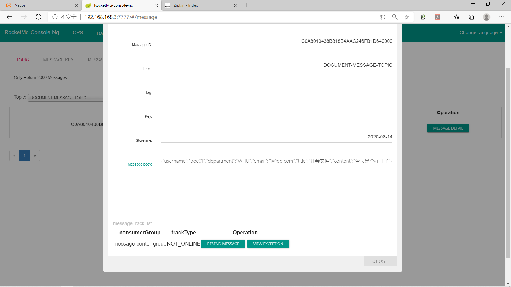

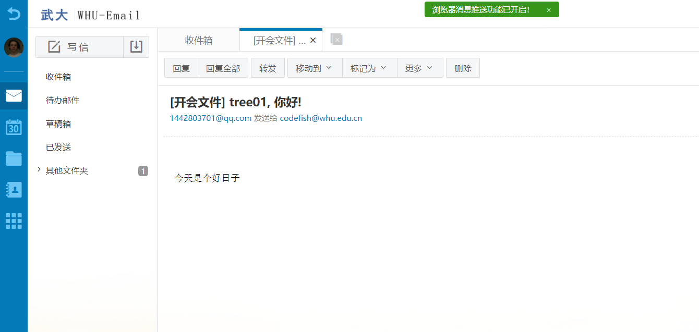

