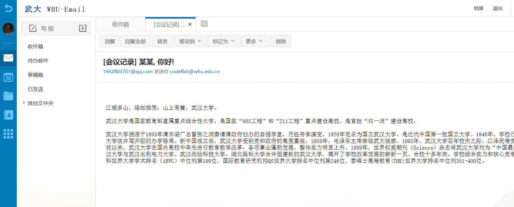
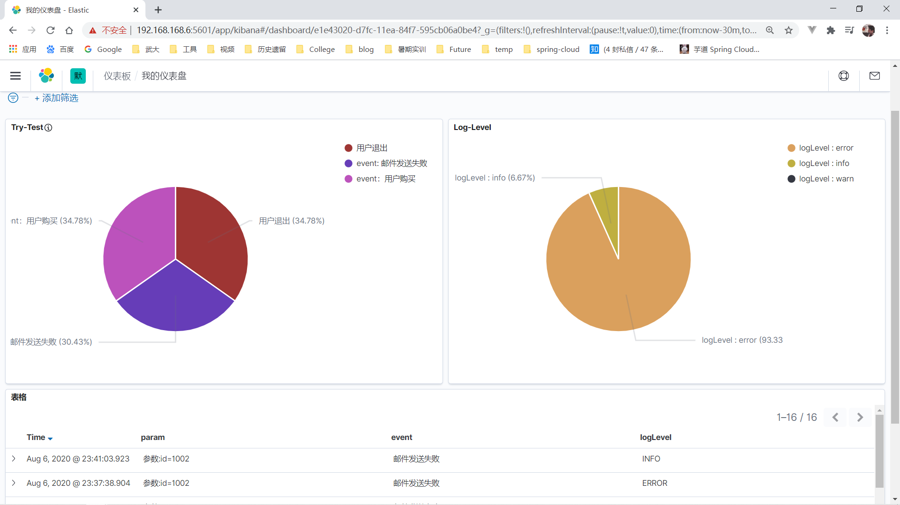

# Temp Readme

> 暂时记录进度，开发完成后更新完善

## Project structure

```lua
sc-microservices-platform -- 父项目，公共依赖
│  ├─sc-business -- 业务模块一级工程
│  │  ├─commons-domin -- 公共domain模块
│  │  ├─document-center -- 公文中心[8081]
│  │  ├─file-center -- 文件中心[8082]
│  │  ├─message-center -- 消息中心[8083]
│  │  ├─user-center -- 用户中心[8084]
│  │─sc-commons -- 通用工具一级工程
│  │  ├─尚未编码，可以自定义一些 spring-boot-starter
│  ├─sc-config -- 配置中心，其余模块可以引入该以来，统一配置
│  ├─sc-gateway -- api网关一级工程[8080]
│  │  ├─尚未编码，可以自定义一些 spring-boot-starter
│  ├─zlt-monitor -- 监控一级工程
│  │  ├─sc-admin -- 应用监控--尚未开发
│  │  ├─log-center -- 日志中心--已经搭好elkf框架，最后整合
│  ├─zlt-uaa -- spring-security认证中心--尚未开发，使用jwt
```


## 目前效果

### 邮件

> 邮件发送成功
>
> 1. 公文中心 调用 用户中心 检查状态
> 2. 公文中心 rocketmq 向 消息中心 发送 自定义消息 DMessage
> 3. 消息中心收到 rocketmq 消息，向用户发送邮件



### ELKF 日志系统可视化

> 虚拟机搭建
>
> 以下显示数据为 demo 数据，并未连接项目，自定义 log pattern 后连接



## 目前功能

### document-center

```lua
# 发送公文
│  ├─openfeign -- 集成 sentinel 实现了 fallback
│  │  ├─调用 user-center -- 判断时间条件
│  │  ├─调用 user-center -- 获取用户信息(username，department，email)
│  ├─rocketmq
│  │  ├─向 message-center -- 发送 DMessage(包含用户邮件信息)
│  │  ├─调用 user-center -- 获取用户信息(username，department，email)
```

### message-center

```shell
# 监听 document-center rocketmq 消息，向用户发送邮件
│  ├─rocketmq
│  │  ├─监听 document-center rocketmq 消息
│  ├─mail
│  │  ├─向用户发送邮件
```

### user-center

```shell
# 未连接数据库，对于 d-c 的服务调用 直接返回模拟数据
```

### file-center

```shell
# 上传下载文件
│  ├─fastdfs
│  │  ├─upload
│  │  ├─download
```

### ELKF 日志框架

```shell
# 完成搭建，可以跑demo
# 部署过程真的坑
```

